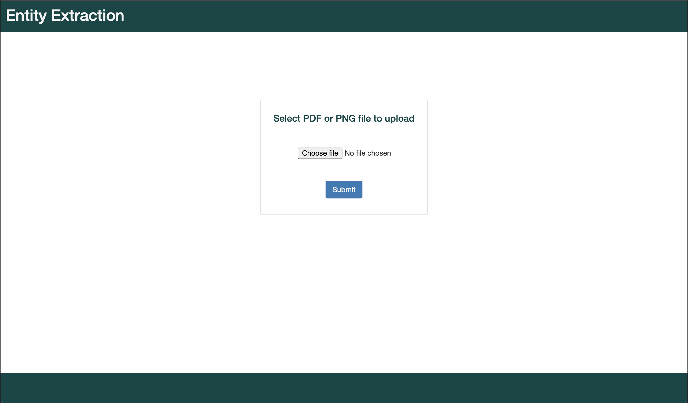

# Entity Extraction

## Table of Contents 
1. [Overview](#overview)
2. [Get Code](#getcode)
3. Setup
    1. [Manually Setup](#setup)
    2. [Automatic Setup](#setupbymakefile)
5. [Setup and run via PyInvoke](#pyinvoke)
7. [Example Usage](#example)

<a name="overview"></a>

## Overview

Entity Extraction is designed to fetch the desired fields from the uploaded documents using Google DLP and Google Vision. Following attributes which are present in the documents uploaded are extracted from it: Complete Name, First Name, Last Name, Street Address and Email Address.

<br>
<a name="getcode"></a>

## Get Code

  You can get code from GitHub with this link: https://github.com/naveentechnolive10/entity-extraction
  Either by download zip file or by run following command on your terminal:
    ```
      git clone https://github.com/naveentechnolive10/entity-extraction.git
    ```

<a name="installation"></a>

## Google Credentials Setup
  
  You can get/create `google_cred.json` by following procedure: https://cloud.google.com/docs/authentication/getting-started

  Once you get `google_cred.json` then either copy below command to your `~/.bash_profile` and run `source ~/.bash_profile` or just run below command on terminal. 
  
  You'll need to run this command on your OS terminal:
    ```
      export GOOGLE_APPLICATION_CREDENTIALS="<path of your google_cred.json>"
    ```
  You can verify by run this command on your OS terminal:
    ```
      echo $GOOGLE_APPLICATION_CREDENTIALS
    ```
  Above will show absolute path of you `google_cred.json` file if not follow above procedure again.
  
## Google Project-ID Setup
  
  Do it by modifying your `src/settings.py`.
  You can get/create `GOOGLE_PROJECT_ID` by following procedure: https://cloud.google.com/resource-manager/docs/creating-managing-projects
  
  You'll need to set the following:
    ```src/settings.py
    GOOGLE_PROJECT_ID: str = "<project_id>"
    ```

<br>
<a name="setup"></a>

####Note: During setup/run application we recommend to use Python 3.7.4 version.

### Setup by manually
1. Create a virtual environment and install `requirements.txt`

<a name="setupbymakefile"></a>

### setup and run by Makefile
before run below commands set DVC variables in .bash_profile file.
- For complete setup: ```make local_make```.
Note: If make utility is not supporting by your Operating System then install/setup by `PyInvoke` as mentioned below.

<a name="pyinvoke"></a>
### Setup via PyInvoke
All the setup for the service can also be done via PyInvoke. There are multiple tasks 
that have been added for the setup and development.

- To start using PyInvoke, firstly it needs to be installed inside the virtual env. follow the steps 
  below for installation
  1) Create a virtual environment. ```python3 -m venv venv```.
  2) Activate the virtual env. ```source venv/bin/activate```. 
  3) Install PyInvoke via pip. ```pip install invoke```.
    
After the installation below commands can be used to list and invoke any tasks.
1) List all the tasks/commands. ```invoke --list```
2) Help regarding any command. ``` invoke <command> --help```
3) To run any task. ``` invoke <command>  --<options>=value```

### Example screenshot



